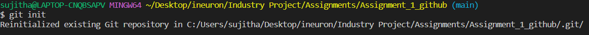

# Task 1: Demonstrate minimum 15 basic Git command with explanation and screenshot.
'''
command1: git-init
Explaination: It is used to initialize the repository. Once hit enter after this command, a hidden folder '.git' will be created in the target folder. The hidden folder contains all the backlog references of the project's history.
'''
Screenshot: